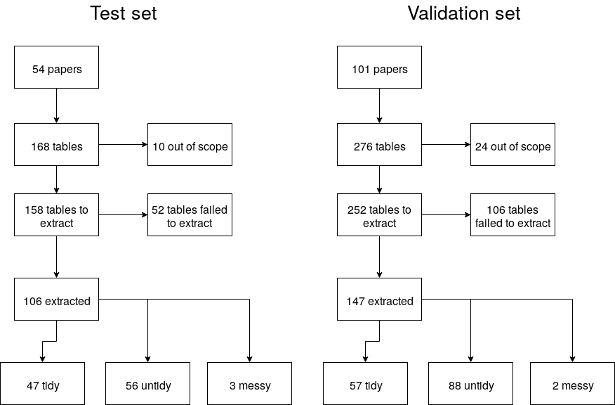

The current project aims to extract information from scholarly tables (semi-)automatically. Scholarly articles frequently contain vital information/statistics in tabular format, but given that the PDF format is a visually oriented tool instead of also being machine-readable, the information from these tables is not readily exportable. For example, simply copy-pasting a table into a spreadsheet is virtually impossible. This greatly decreases the efficiency of data collection in systematic reviews. This document is the final report for the project that ran from circa March 2017 through April 2017, contracted by the [EPPI-centre](https://www.ucl.ac.uk/public-policy/spotlight/eppi-centre). 

We developed software for table extraction in two stages: (1) testing and (2) validation. Throughout this report the results of both will be presented alongside each other in order to improve comparison of the software's performance. In this report we do not present the results of the automated table identification procedure, but these can be found [here](https://github.com/ContentMine/cm-ucl/blob/master/interim-reports/grobid-table-retrieval.pdf). Additionally, all individual tables and the extracted results can be inspected via the [project's webpage](https://contentmine.github.io/cm-ucl).

The current report showcases some of the vital metrics of the resulting software's performance. However, in no way is this meant to be exhaustive of the data collected. The [data are freely available](https://github.com/ContentMine/cm-ucl/tree/master/data) for reanalysis and the [code behind this report](https://github.com/ContentMine/cm-ucl/blob/master/final-report.Rmd) as well. Additionally, the steps taken to come to this end-product are more extensive than a summary report can contain; more extensive technical details are available on the project's [Open Notebook](http://discuss.contentmine.org/t/ami-eppi-cm-ucl-table-extraction-project/322/47) and [Github repository](https://github.com/contentmine/cm-ucl). However, [documentation](#documentation) is available at the end of the report.

## Corpus

After coordination with EPPI, we selected Open Access papers with tables from a selection of [26 journals](https://github.com/ContentMine/cm-ucl/blob/master/data/test-pubs-jrnls.csv). Figure 1 depicts the flowchart of the table extraction from both the test and validation corpus. The raw corpora are available on Github ([test set](https://github.com/ContentMine/cm-ucl/tree/master/corpus-oa), [validation set](https://github.com/ContentMine/cm-ucl/tree/master/corpus-oa-validation)).

```{r flowchart-fig, fig.cap="_Figure 1._ Flowcharts of corpus to extracted tables.", out.width='80%', fig.align='center', echo = FALSE}
par(mar = c(0, 0, 0, 0))

```

## Metrics

Each table has certain aspects that can be taken into account for retrieval rates. In this report we focus on the following for the tables we were able to extract (see Figure 1):

1. Are the body and header sections of a table aligned?

2. Is the row and column structure of the table correctly retrieved?

3. How many discrepancies in the cells of extracted table are there?

For these metrics, tables were classified into three categories: (1) messy, (2) untidy, and (3) tidy. "Messy" includes tables that contain subtables (for example), whereas tidy are simple matrix-like tables (_i_ rows and _j_ columns); untidy tables include nested columns/rows but no messy structuring beyond that.

```{r read in data, echo = FALSE}
library(ggplot2)
library(plyr)

testdf <- read.csv('data/metrics-test.csv')
valdf <- read.csv('data/metrics-validation.csv')

# Add normalized
testdf$normal_disc <- testdf$discrepancy_cell_count / (testdf$man_cols * testdf$man_rows)
valdf$normal_disc <- valdf$discrepancy_cell_count / (valdf$man_cols * valdf$man_rows)

testdf <- testdf[testdf$scope == 1 & !is.na(testdf$table_nr), ]
valdf <- valdf[valdf$scope == 'in' & !is.na(valdf$table_nr), ]

testdf <- testdf[!is.na(testdf$discrepancy_cell_count), ] 
valdf <- valdf[!is.na(valdf$discrepancy_cell_count), ] 

testdf$table_complexity <- factor(testdf$table_complexity, 
                               levels = c('messy',
                                          'untidy',
                                          'tidy'))

valdf$table_complexity <- factor(valdf$table_complexity, 
                               levels = c('messy',
                                          'untidy',
                                          'tidy'))
```

### Table alignment

The tables below indicate the proportion of bodies and headers that were extracted from the respective sets of tables in an aligned manner. For the test and validation set, the results are fairly similar. Unexpectedly, the alignment in the tidy tables is less than in the untidy tables.

```{r echo=FALSE}
x <- table(testdf$table_complexity, testdf$header_aligned) / dim(testdf)[1]
x <- cbind(x, table(valdf$table_complexity, valdf$header_aligned) / dim(valdf)[1])
colnames(x) <- c('test; not aligned', 'test; aligned', 'validation; not aligned', 'validation; aligned')

knitr::kable(x, caption = '_Table 1._ Automated alignment of table body and header for both the test and validation sets', digits = 3)
```

### Table structure and cell integrity

```{r echo=FALSE}
testtmp <- abs(testdf$man_cols - testdf$cols_retrieved) + abs(testdf$man_rows - testdf$rows_retrieved)
testdf$structure_retrieved <- ifelse(testtmp == 0, 'no row/column discrepancies',
       ifelse(testtmp == 1, '1 row/column discrepancy',
              ifelse(testtmp > 1 & testtmp < 4, 
                     '1<x<4 row/column discrepancies',
                     '>=4 row/column discrepancies')))
testdf$structure_retrieved <- factor(testdf$structure_retrieved,
                         levels = c('>=4 row/column discrepancies',
                                    '1<x<4 row/column discrepancies',
                                    '1 row/column discrepancy',
                                    'no row/column discrepancies'))

testdf$discrepancy_factor <- ifelse(testdf$discrepancy_cell_count == 0,
                                 'no cell discrepancies',
                                 ifelse(testdf$discrepancy_cell_count == 1,
                                        '1 cell discrepancy',
                                        ifelse(testdf$discrepancy_cell_count > 1  & testdf$discrepancy_cell_count < 4,
                                               '1<x<4 cell discrepancies',
                                               '>=4 cell discrepancies')))


testdf$discrepancy_factor <- factor(testdf$discrepancy_factor,
                                  levels = c('>=4 cell discrepancies',
                                             '1<x<4 cell discrepancies',
                                             '1 cell discrepancy',
                                             'no cell discrepancies'))

valtmp <- abs(valdf$man_cols - valdf$cols_retrieved) + abs(valdf$man_rows - valdf$rows_retrieved)
valdf$structure_retrieved <- ifelse(valtmp == 0, 'no row/column discrepancies',
       ifelse(valtmp == 1, '1 row/column discrepancy',
              ifelse(valtmp > 1 & valtmp < 4, 
                     '1<x<4 row/column discrepancies',
                     '>=4 row/column discrepancies')))
valdf$structure_retrieved <- factor(valdf$structure_retrieved,
                         levels = c('>=4 row/column discrepancies',
                                    '1<x<4 row/column discrepancies',
                                    '1 row/column discrepancy',
                                    'no row/column discrepancies'))

valdf$discrepancy_factor <- ifelse(valdf$discrepancy_cell_count == 0,
                                 'no cell discrepancies',
                                 ifelse(valdf$discrepancy_cell_count == 1,
                                        '1 cell discrepancy',
                                        ifelse(valdf$discrepancy_cell_count > 1  & valdf$discrepancy_cell_count < 4,
                                               '1<x<4 cell discrepancies',
                                               '>=4 cell discrepancies')))


valdf$discrepancy_factor <- factor(valdf$discrepancy_factor,
                                  levels = c('>=4 cell discrepancies',
                                             '1<x<4 cell discrepancies',
                                             '1 cell discrepancy',
                                             'no cell discrepancies'))
```

The tables below indicate the proportion of tables that contain several categories of errors. The bottom-right hand cell is the one that denotes perfectly retrieved tables (i.e., perfectly maintains both table row/column structure and cell integrity). This amounts ~30% in both the test and validation set. Perfect might be too strict given that the nesting of untidy tables was out of scope; relaxing it to one structure error or a cell error raises the proportion of tables to `r .311 + .198 + .009 + .066` for the test set and `r .310 + .085 + .085 + .021` for the validation set. 

```{r echo = FALSE}
knitr::kable(table(testdf$structure_retrieved, testdf$discrepancy_factor) / sum(table(testdf$structure_retrieved, testdf$discrepancy_factor)), digits = 3, caption = '_Table 2._ Table structure retrieval for test set, based on rows and cell contents.')

knitr::kable(table(valdf$structure_retrieved, valdf$discrepancy_factor) / sum(table(valdf$structure_retrieved, valdf$discrepancy_factor)), digits = 3, caption = '_Table 3._ Table structure retrieval for validation set, based on rows and cell contents.')
```

The tables can be divided in to four quadrants, where we see a logical clustering of structure and cell integrity. Few structure and cell errors (lower right-hand) cluster, and multiple structure and cell errors cluster as well. As would be expected, the software doesn't create large discrepancies in the structure but not in the cells --- the co-occurence is a sign the software does not systematically act up. Some tables might contain more errors in both the structure and the cells, but that indicates that there is ground for improvement in the coverage of the software (as in UCL-II).

### Normalized discrepancies

Not each table is of the same size or complexity, hence, one could argue that one error is worse in a 3x3 table than in a 42x42 table. Considering this, we computed normalized discrepancy scores (i.e., number of cell discrepancies divided by the amount of cells). As a result, we can directly compare the values across tables of variable complexity. Figure 2 indicates that this is a severely skewed distribution, as would be expected, and that most tables fall within a 0-20% range of discrepancies, with a few (far) above those. The larger discrepancies can be investigated further to determine optimal ways to improve the software in the future.

```{r test, fig.cap="_Figure 2._ Density distributions of normalized discrepancy scores (i.e., number of cell discrepancies divided by the amount of cells). The more to the right in a plot, the larger the normalized discrepancy and a larger problem for the software. Validation set contained too few data to plot messy tables.", echo=FALSE}
testdf$set <- "test"
valdf$set <- "validation"
ggset <- rbind(testdf[,c(23, 7, 26)], valdf[,c(22, 7, 25)])
suppressWarnings(ggplot(ggset, aes(x = normal_disc)) + 
  geom_density(aes(color = table_complexity, fill = table_complexity,
                   alpha = .2)) + facet_wrap( ~ set) + xlim(0, 1))

```

## Documentation

In order to extract information from the raw scholarly articles, a set of 7 steps are taken. The following commands are based on the validation set in the folder `corpus-oa-validation` and assumes the Github repository is cloned. Steps 1 and 2 are included for cases where the PDFs are yet to be downloaded and organized.

1. Download all PDFs of the article

2. Organize the PDFs into a `cproject` structure
  a. A `cproject` structure looks as follows
```bash
corpus-oa-validation
├── 10.1007_s00213-016-4512-6
│   ├── fulltext.pdf
├── 10.1007_s00213-016-4518-0
│   ├── fulltext.pdf
├── 10.1007_s00213-016-4519-z
│   ├── fulltext.pdf
...
...
...
├── 10.1371_journal.pone.0173179
│   ├── fulltext.pdf
```
  b. If you have a set of PDFs in a folder, this command will reformat it into a `cproject` structure.
    
```bash
./norma-2017-03-16/bin/norma --project corpus-oa-validation --makeProject (\1)/fulltext.pdf --fileFilter .*/(.*)\.pdf
```

3. Convert the PDFs to SVGs with the following command

```bash
./norma-2017-04-11/bin/norma --project corpus-oa-validation/ --input fulltext.pdf --transform pdf2svg --outputDir corpus-oa-validation/
```

4. Manually cut out the tables in an SVG editor (recommended: Inkscape) and organize them in a subfolder `tables/table1/table.svg` structure.

5. Run the software to convert the SVG into HTML and CSV

```bash
./norma-2017-03-16/bin/norma --project  corpus-oa-validation --fileFilter ^.*tables/table\(\\d+\)/table.svg  --outputDir corpus-oa-validation --transform stable2html
  
./norma-2017-03-16/bin/norma --project  corpus-oa-validation --fileFilter ^.*tables/table\(\\d+\)/table.svg  --outputDir   corpus-oa-validation --output table.svg.csv  --transform svgtable2csv
```

6. To present the extracted tables in an easy to consume way, first convert the SVGs to PNGs (make sure to have `svg2png` installed)

```bash
for FILE in `ls */tables/*/table.svg`; do inkscape --verb=FitCanvasToDrawing --verb=FileSave --verb=FileClose $FILE; done

for FILE in `ls */tables/*/table.svg`; do svg2png $FILE -o $FILE.png; done
```

7. Create an overview file (`corpus-oa-validation/tableView.html`) with side-by-side comparisons of the extracted tables and the original

```bash
./norma-2017-03-16/bin/norma --project corpus-oa-validation --fileFilter ^.*tables/table\\d+$  --output  ./tableRow.html  --htmlDisplay  ^.*/table.svg.png ^.*/table.svg.html

./norma-2017-03-16/bin/norma --project corpus-oa-validation --output  tables/tableView.html  --htmlAggregate ^.*tables/table\\d+/tableRow.html

./norma-2017-03-16/bin/norma --project corpus-oa-validation --output tableViewList.html --projectMenu .*/tables/tableView.html
```